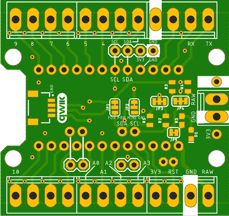
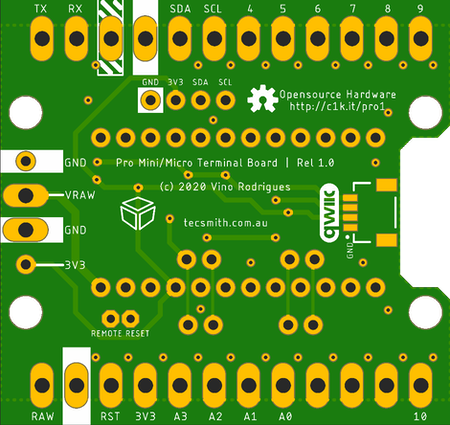

# Pro Micro / Pro Mini Screw Terminal Breakout

**Pro Micro Screw Terminal Breakout**, for mounting "Pro Micro" boards.

GitHub repository at [Tecsmith/arduino-pro-micro-screw-terminal](https://github.com/Tecsmith/arduino-pro-micro-screw-terminal)

## Specifications

- Simple breakout in the Qwiic board form factor exposing Pro Micro / Pro Mini pins to screw terminals
- Supports many "pro micro" based boards, e.g.:
  - Sparkfun [Pro Micro](https://www.sparkfun.com/products/12587)
  - Zio [ZUINO XS PSYFI32](https://www.smart-prototyping.com/Zuino-XS-PsyFi32.html)
  - Arduino [Pro Mini](https://store.arduino.cc/usa/arduino-pro-mini) <small style="color:red">{*RETIRED*}</small>
  - April Brother [Cactus Micro](https://wiki.aprbrother.com/en/Cactus_Micro_Rev2.html) <small style="color:red">{*RETIRED*}</small>
- 2x Qwiic connectors (works with SparkFun's [Qwiic Connect System](https://www.sparkfun.com/qwiic))
- Standard I2C breakout pins
- Remote reset button via JST-PH-2 header

## On Board Jumpers

### JP1, JP2 & JP3

- For use with the retired Arduino Pro Mini.  Refer to the schematic for use.

### JP4 - I2C Pull Ups (top)

- Connected _(default)_: 4.7KΩ pullups
- Cut both sides: No pullups

### JP5 - LED Enable (top)

- Connected _(default)_: LED shows power state
- Cut: LED disabled

## Manufacturing
-------------

* Schematic print: [pro-micro-screw-terminal-v1.0.pdf](pro-micro-screw-terminal-v1.0.pdf)
* Schematic source (in EAGLE): [Tecsmith/arduino-pro-micro-screw-terminal/EAGLE/pro-micro-screw-terminal-v1.0.sch](https://github.com/Tecsmith/arduino-pro-micro-screw-terminal/blob/main/EAGLE/pro-micro-screw-terminal-v1.0.sch)
* PCB design (in EAGLE): [Tecsmith/arduino-pro-micro-screw-terminal/EAGLE/pro-micro-screw-terminal-v1.0.brd](https://github.com/Tecsmith/arduino-pro-micro-screw-terminal/blob/main/EAGLE/pro-micro-screw-terminal-v1.0.brd)

  
  &nbsp;
  
   
  Initial prototype built by JCLPCB

★

